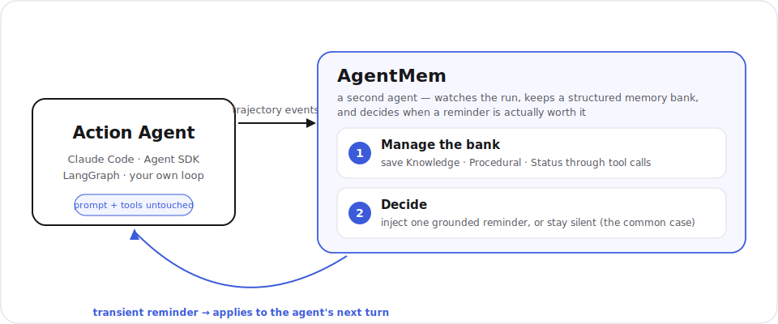

<div align="center">

<picture>
  <source media="(prefers-color-scheme: dark)" srcset="assets/brand/lockup-white.svg">
  
</picture>

**Memory that doesn't just store. It knows *when* to remind.**

A proactive memory layer for long-horizon coding agents.
Runs alongside Claude Code, the Claude Agent SDK, LangGraph, Aider, or your own loop,
without changing how they work.

[](https://github.com/agentmem/agentmem/actions/workflows/ci.yml)
[](./LICENSE)
[](https://www.python.org/downloads/)

</div>

---

## The problem

Give an agent a task that spans hours or several sessions and it starts to *forget how to behave*.
The requirement it was told at turn 2 is still in the transcript at turn 80, but it no longer
influences what the agent does. It re-runs the command that already failed twice. It re-breaks the
public API it was told not to touch. The paper this project is based on calls this
**behavioral state decay**: the information is technically present, but it has stopped steering
decisions.

The usual answer (vector-store memory like Mem0 or Letta) treats memory as *storage*: write
everything, retrieve on similarity. That helps recall, but it doesn't answer the harder question:
**at this exact step, should the agent be reminded of anything, and if so, what?**

## The idea

AgentMem is a second, small agent that watches the trajectory and maintains a structured
**memory bank** in two phases on a fixed cadence (plus a few useful event triggers):

1. **Manage the bank:** save stable facts (*Knowledge*), record attempts and outcomes
   (*Procedural*), keep private working notes (*Status*). All edits happen through tool calls, so
   the bank is auditable, not a free-form rewrite.
2. **Decide whether to intervene:** read the freshly-updated bank and either inject a short,
   grounded reminder into the agent's *next* turn, or stay silent. **Silence is the default and the
   common case.**

That second phase is the whole point. The paper's ablations show that *selectively* intervening
beats dumping the whole bank, beats always-injecting, and beats plain semantic retrieval. Knowing
when to stay quiet is a feature, not an omission.

> AgentMem never edits the action agent's system prompt, tools, or decoding. Reminders are
> **transient**: injected once, consumed once, never baked into base instructions.

## Quickstart

```bash
pip install agentmem        # or: uv add agentmem
agentmem demo               # offline, no key needed: watch memory stop a repeated failure

export ANTHROPIC_API_KEY=sk-ant-...   # then point it at your own agent (see below)
```

Wrap your own loop in five lines:

```python
from agentmem import MemorySession, triggers

mem = MemorySession(
    task="Fix the failing auth tests without changing the public API",
    model="claude-haiku-4-5",
    store="sqlite:///.agentmem/run.db",
    trigger=triggers.default(),          # every 3 turns + on tool failure
)

while not done:
    reminder = mem.pending_context()     # str | None, O(1), just reads a cache
    reply = call_your_agent(messages, memory_context=reminder)
    mem.observe(reply.new_messages)      # non-blocking; runs a memory-step if a trigger fires
```

## How it fits in

<div align="center">
  
</div>

Two design decisions do most of the work:

- **Async compute, sync inject.** The memory-step (an LLM call) runs on a background worker after
  each event. Hooks and `pending_context()` only ever read a cache, so they return in well under a
  hundred milliseconds and never stall the agent. This is sound because a reminder always applies to
  the *next* turn, so there's time to compute it.
- **The core imports nothing from the integrations.** Claude Code, the Agent SDK, and LangGraph all
  sit on top of the same public API, and the LLM provider is one adapter (Anthropic today; a litellm
  adapter for OpenAI, vLLM, or local models is planned).

## Why not just... Mem0 / Letta / a `memory.md` file?

| | Storage-style memory | AgentMem |
|---|---|---|
| Core operation | write + retrieve on similarity | maintain a bank **and decide when to remind** |
| Default behavior | surface matching memories | **stay silent**; intervene only when it changes the next action |
| What's remembered | mostly facts | facts **and** procedural experience (what failed, what fixed it) |
| Grounding | retrieved chunks | every reminder cites a specific entry id, with a cooldown against nagging |

They're complementary: you can point AgentMem's store at a vector DB. The difference is
architectural: retrieval answers *what's relevant*, AgentMem answers *whether to speak now*.

## Status

Early and moving fast. The public API (`MemorySession`, `triggers.*`) is the part we keep stable;
everything else may shift until `0.1.0`. Offline tests run without a key (LLM calls are mocked); the
benchmark numbers land with the first release. See [`evals/`](./evals).

**Built**

- Core two-phase memory agent, event triggers, JSONL telemetry, and the `agentmem demo`.
- Integrations: the Claude Code daemon + hooks, the Claude Agent SDK adapter, and a LangGraph
  node, each leaving the action agent's prompt, tools, and decoding untouched.
- **Causal memory:** link entries (`caused_by`, `fixed_by`, `rules_out`, and more) so a reminder
  can carry the cause → fix chain across sessions.
- **Continual memory:** salience-based forgetting (active → dormant → archived, nothing
  hard-deleted), a consolidation ladder, and promotion of durable lessons into a project-wide
  bank. See [`docs/how-agentmem-forgets.md`](./docs/how-agentmem-forgets.md).
- **Advantage layer:** a training-free signal that learns, from graded outcomes, when
  intervening tends to pay off, and can gate a would-be reminder back to silence.
- An ablation eval harness with two benchmark suites ([`evals/`](./evals)).

**Next:** live benchmark numbers, a docs site, the first PyPI release, the `agentmem.xyz` landing.

**Later:** a hosted API, and a fine-tuned open-weight memory policy.

## Contributing

Issues and PRs welcome. This only gets good with real trajectories from real agents. Start with
[CONTRIBUTING.md](./CONTRIBUTING.md) and the "good first issue" label. Development is `uv`-based:

```bash
uv sync
uv run pytest          # unit tests; no API key needed (LLM calls are mocked)
uv run ruff check .
uv run mypy packages/agentmem/src
```

## Credits & license

The architecture reimplements, clean-room, the two-phase proactive-memory design from
*"Remember When It Matters: Proactive Memory Agent for Long-Horizon Agents"* (arXiv:2607.08716).
We built from the published paper's specification, not from the authors' code. See
[NOTICE](./NOTICE).

Licensed under [Apache-2.0](./LICENSE).
